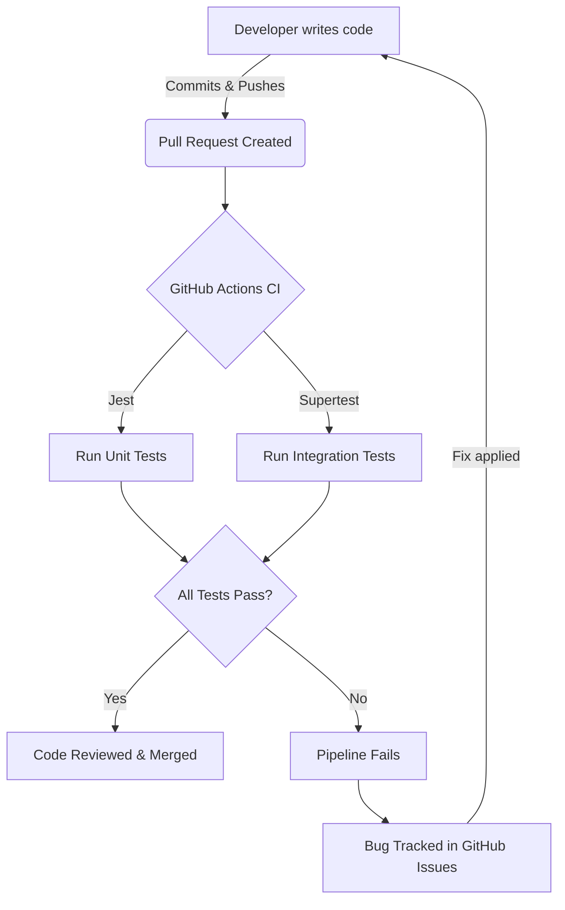
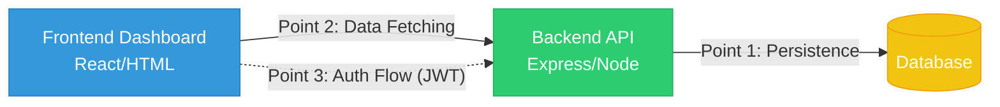
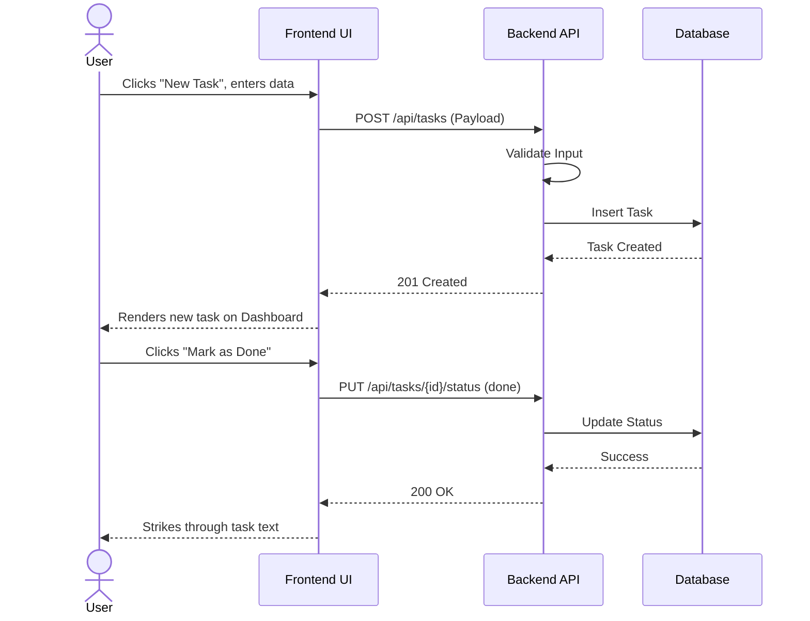

# Software Quality & Testing Plan

**Project:** Personal Logistics and Life Administration Tracker  
**Team:** AdminOPs  
**Members:** James Rhodes, Shane Stroud  
**Date:** March 1, 2026  

---

## 1. Testing Strategy Overview

**Testing Philosophy:** 
Our team follows a "Test-Driven and Continuous" philosophy. We believe that catching bugs early in the development lifecycle is cheaper and more efficient than fixing them in production. We use a layered testing approach (Unit -> Integration -> End-to-End) to ensure both individual functions and complex user journeys work flawlessly.

**Tools We Will Use:**
*   **Unit & Integration Testing:** Jest (JavaScript testing framework)
*   **API Testing:** Postman / Supertest
*   **End-to-End (E2E) Testing:** Cypress
*   **CI/CD Pipeline:** GitHub Actions (Automated test runner)

**Integration into Sprint Process:**
Testing is embedded into our Definition of Done (DoD). No pull request (PR) can be merged into the `main` branch unless it passes all automated GitHub Actions checks and maintains or improves our test coverage. 

**Responsibilities:**
*   **James Rhodes:** Lead on Backend API integration tests and database mock testing.
*   **Shane Stroud:** Lead on Frontend E2E testing, Unit testing core logic, and managing the GitHub defect tracking board.

---

## 2. Unit Test Plan

Here are 5 core modules/functions we are unit testing for the Logistics Tracker:

### Unit 1: `createTask(title, category, dueDate)`
*   **What it does:** Validates input and constructs a new task object for life administration.
*   **Normal Case 1:** Input: `("Pay Rent", "Finance", "2026-03-05")` -> Expected Output: Task object with `status: "pending"` and generated UUID.
*   **Normal Case 2:** Input: `("Buy Groceries", "Home", null)` -> Expected Output: Task object with no due date set.
*   **Edge Case:** Input: `("", "Finance", "2026-03-05")` -> Expected Output: Throws `ValidationError("Title cannot be empty")`.

### Unit 2: `calculatePriority(dueDate, importanceLevel)`
*   **What it does:** Automatically assigns a priority (Low, Medium, High, Critical) based on how close the due date is and user importance.
*   **Normal Case 1:** Input: `("2026-03-02", "High")` -> Expected Output: `"Critical"` (Due today).
*   **Normal Case 2:** Input: `("2026-12-01", "Low")` -> Expected Output: `"Low"`.
*   **Edge Case:** Input: `("2020-01-01", "Medium")` (Past date) -> Expected Output: `"Critical"` (Overdue).

### Unit 3: `authenticateUser(email, password)`
*   **What it does:** Hashes the provided password and compares it to the database to issue an auth token.
*   **Normal Case 1:** Input: Valid email/password -> Expected Output: Returns JWT (JSON Web Token) and `status: 200`.
*   **Normal Case 2:** Input: Valid email, wrong password -> Expected Output: Returns `status: 401 Unauthorized`.
*   **Edge Case:** Input: SQL Injection attempt `email = "admin@email.com' OR 1=1;--"` -> Expected Output: Fails validation, returns `status: 400 Bad Request`.

### Unit 4: `generateWeeklySummary(userId)`
*   **What it does:** Aggregates completed and pending logistics tasks for the week to display on the dashboard.
*   **Normal Case 1:** Input: `userId` with 5 completed, 2 pending -> Expected Output: `{ completed: 5, pending: 2, efficiency: "71%" }`.
*   **Normal Case 2:** Input: `userId` with 0 tasks -> Expected Output: `{ completed: 0, pending: 0, efficiency: "N/A" }`.
*   **Edge Case:** Input: Invalid/Null `userId` -> Expected Output: Throws `UserNotFoundError`.

### Unit 5: `validateExpenseAmount(amount)`
*   **What it does:** Ensures that monetary inputs for the logistics tracker are formatted correctly before hitting the database.
*   **Normal Case 1:** Input: `50.25` -> Expected Output: `50.25` (Float).
*   **Normal Case 2:** Input: `"100"` -> Expected Output: `100.00` (Converted string to float).
*   **Edge Case:** Input: `-50` (Negative expense) -> Expected Output: Throws `InvalidAmountError`.

---

## 3. Integration Test Plan

The following diagram maps our integration points, followed by the test scenarios for each.

### Integration Point 1: API ↔ Database (Task Persistence)
*   **Components Tested:** API `/api/tasks` endpoint connecting to the database.
*   **What is Validated:** Verifying that a POST request successfully writes to the database and a GET request retrieves the exact same data.
*   **Expected Result:** A valid JSON payload sent to the API results in a 201 Created status, and querying the DB returns the record.
*   **Failure Scenario:** Database connection timeout. The API should catch the timeout and return a `503 Service Unavailable` cleanly.

### Integration Point 2: Frontend Dashboard ↔ API Data Fetching
*   **Components Tested:** The React/UI Dashboard requesting data from the backend API.
*   **What is Validated:** The UI correctly handles the asynchronous API call, displaying a loading spinner, and then rendering the list of administrative tasks.
*   **Expected Result:** Dashboard populates with 10 recent tasks.
*   **Failure Scenario:** API returns a 500 error. The UI should catch this and display a friendly error banner.

### Integration Point 3: Authentication Flow (Login -> Protected Routes)
*   **Components Tested:** Login UI ↔ Auth API ↔ Protected Endpoints.
*   **What is Validated:** Ensuring that a user cannot access `/api/user/settings` without a valid token generated by `/api/auth/login`.
*   **Expected Result:** Requesting settings with a valid token returns user data.
*   **Failure Scenario:** Requesting settings with an expired token results in a `401 Unauthorized` and the UI redirects to the login page.

---

## 4. System / End-to-End Test Scenarios

### Workflow 1: User Onboarding and Registration
*   **Step-by-step actions:**
    1. User navigates to the landing page and clicks "Sign Up".
    2. User fills out Email, Password, and Name.
    3. User submits the form.
    4. System redirects to the Welcome Dashboard.
*   **Expected outcome:** A new user account is created in the database, the user is logged in, and the dashboard renders the tutorial.
*   **Possible failure points:** Email already exists (should show UI error), password doesn't meet strength requirements.

### Workflow 2: Creating and Completing a Life Admin Task
The sequence diagram below illustrates the end-to-end data flow for this test scenario:

*   **Step-by-step actions:**
    1. Logged-in user clicks "New Task".
    2. Enters "Renew Car Registration", selects "Vehicle" category, and sets tomorrow's date.
    3. Clicks "Save".
    4. Locates the task on the dashboard and clicks the "Mark as Done" checkbox.
*   **Expected outcome:** Task is successfully saved, dynamically appears on the dashboard without a page reload, and striking it marks it complete in both the UI and the database.
*   **Possible failure points:** UI fails to update optimistically, API fails to register the "Done" status leaving the database and UI out of sync.

---

## 5. Non-Functional Testing Considerations

*   **Performance:** The dashboard must load in under 2 seconds. We will implement basic pagination on the API so we don't send thousands of completed tasks to the frontend at once.
*   **Security:** Passwords will be heavily hashed using Bcrypt. We will test for JWT token security to ensure users can only access their *own* logistics data, not data belonging to others (IDOR vulnerabilities).
*   **Input Validation:** All API endpoints will utilize an input sanitization library to strip out malicious HTML/JavaScript to prevent Cross-Site Scripting (XSS).
*   **Error Handling:** We will never expose raw stack traces to the user. All backend errors will be intercepted and mapped to generic, user-friendly messages.

---

## 6. Defect Tracking Method

*   **How we track bugs:** We use **GitHub Issues** as our centralized bug tracker. 
*   **Where defects are documented:** Every bug is filed as a GitHub Issue using a standardized template. Issues will be tagged with labels such as `bug`, `high-priority`, `frontend`, or `backend`.
*   **Resolution tracking:** **Shane Stroud** acts as the QA lead to triage bugs. When a developer starts working on a bug, they move the issue to "In Progress" on our GitHub Project Board. Once fixed, the Pull Request will reference the issue (e.g., "Fixes #12") so GitHub automatically closes the defect when the code is merged.
