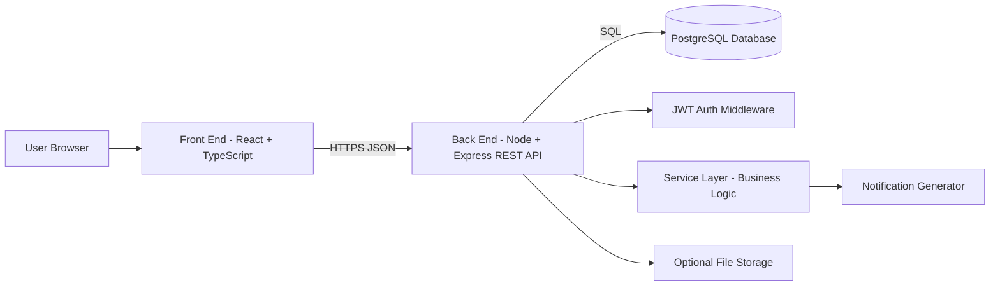

# System Architecture Design Package
**Project:** Personal Logistics and Life Administration Tracker  
**Team:** AdminOPs  
**Members:** James Rhodes,Shane Stroud 
**Date:** 2/22/2026

---

## 1. System Overview 
The Personal Logistics and Life Administration Tracker is a full-stack web application that helps individuals manage life responsibilities such as document renewals, deadlines, recurring obligations, and one-time tasks in one centralized place. Instead of relying on scattered notes, emails, calendars, or memory, users can store items with due dates, categories/tags, statuses, and recurrence rules. The system highlights what is overdue and what is due soon to reduce missed deadlines, late fees, wasted time, and stress.

The primary users are people managing personal responsibilities, especially those with inconsistent schedules (shift work, travel rotation, students, multiple jobs). High-level workflows include: creating an account and logging in, creating/editing/deleting tasks and renewal items, viewing a dashboard that groups items into overdue/due soon/upcoming, completing items (including generating the next occurrence for recurring items), and viewing/marking notifications for items due soon or overdue.

---

## 2. High-Level Architecture Diagram

### Diagram (Boxes and Arrows)


### Component Responsibilities
- **Front End (React + TypeScript):** UI screens (login, create item, dashboard), form validation, sends/receives JSON to/from API.
- **Back End (Node/Express):** auth + authorization, input validation, CRUD endpoints, dashboard queries, recurrence engine, notification generation.
- **Database (PostgreSQL):** stores users, items, tags/categories, item-tag mappings, notifications, and optional attachments metadata.
- **Optional File Storage:** stores uploaded attachments (if implemented); file metadata stored in DB.

### Data Flow Between Components
1. User interacts with the UI in the browser.
2. UI sends HTTPS requests to the Express REST API with JSON payloads.
3. API verifies JWT on protected routes, runs business logic, and reads/writes PostgreSQL data.
4. API returns JSON responses to update the UI.

---

## 3. Layering / Code Organization Plan

### Proposed Folder / Module Structure
```text
/client
  /src
    /pages
    /components
    /services (API calls)
    /types
/server
  /src
    /routes
    /controllers
    /services
    /middleware
    /db
      /migrations
      /repositories
    /utils
/docs
/tests
  /api
```

### How This Separation Reduces Coupling and Improves Maintainability
The project separates concerns by keeping UI code in the client, HTTP routing and request handling in controllers/routes, business rules in a service layer, and database logic in repositories. This reduces coupling because the UI does not depend on database details and business logic is centralized instead of spread across endpoints. It improves maintainability by making features easier to test, change, and debug (for example, recurrence and notification logic can be updated in one place without rewriting multiple route handlers).

---

## 4. Database Schema (Tables + Fields + Relationships)

### Entity 1: `users`
- **Primary Key:** `id`
- **Fields:**  
  - `email` (required, **unique**)  
  - `password_hash` (required)  
  - `created_at` (required)

### Entity 2: `items`
- **Primary Key:** `id`
- **Foreign Key:** `user_id` → `users.id` (required)
- **Fields:**  
  - `title` (required)  
  - `notes` (optional)  
  - `due_date` (required)  
  - `status` (required)  
  - `recurrence_type` (required)  
  - `recurrence_interval` (optional)  
  - `archived_at` (optional)  
  - `created_at` (required)

### Entity 3: `notifications`
- **Primary Key:** `id`
- **Foreign Keys:**  
  - `user_id` → `users.id` (required)  
  - `item_id` → `items.id` (recommended)
- **Fields:**  
  - `type` (required)  
  - `message` (required)  
  - `is_read` (required, default `false`)  
  - `created_at` (required)

### Optional Entity: `tags`
- **Primary Key:** `id`
- **Foreign Key:** `user_id` → `users.id` (required)
- **Fields:**  
  - `name` (required)

### Optional Join Table: `item_tags` (Many-to-Many)
- **Composite Primary Key:** (`item_id`, `tag_id`)
- **Foreign Keys:**  
  - `item_id` → `items.id`  
  - `tag_id` → `tags.id`

### Constraints Notes
- `users.email` must be unique.
- `items.title` and `items.due_date` are required.
- `items.status` constrained to: `pending`, `completed`, `overdue`, `archived`.
- All user-owned tables must include `user_id`, and every query must enforce ownership checks.

---

## 5. API / Interface Plan (6+ Endpoints)

### 1) POST /api/auth/register
- **Input:** `{ "email": string, "password": string }`
- **Output:** `201 Created` → `{ "userId": string }` (or `{ "token": string }` if auto-login)
- **Error case:** `409 Conflict` if email already exists

### 2) POST /api/auth/login
- **Input:** `{ "email": string, "password": string }`
- **Output:** `200 OK` → `{ "token": string }`
- **Error case:** `401 Unauthorized` if credentials are invalid

### 3) GET /api/items
- **Input:** query params optional: `status`, `tag`, `dueFrom`, `dueTo`, `sort`
- **Output:** `200 OK` → `[ { item... } ]`
- **Error case:** `401 Unauthorized` if missing/invalid token

### 4) POST /api/items
- **Input:** `{ "title": string, "due_date": string, "notes"?: string, "status"?: string, "recurrence_type"?: string, "tags"?: string[] }`
- **Output:** `201 Created` → `{ "item": { ... } }`
- **Error case:** `400 Bad Request` if required fields missing or invalid date

### 5) PUT /api/items/:id
- **Input:** `{ "title"?: string, "due_date"?: string, "notes"?: string, "status"?: string, "recurrence_type"?: string, "tags"?: string[] }`
- **Output:** `200 OK` → `{ "item": { ... } }`
- **Error case:** `404 Not Found` if item does not exist or does not belong to the user

### 6) POST /api/items/:id/complete
- **Input:** none (or `{ "completedAt"?: string }`)
- **Output:** `200 OK` → `{ "completedItem": { ... }, "nextItem"?: { ... } }`
- **Error case:** `409 Conflict` if already completed OR recurrence duplicate is prevented

### 7) GET /api/dashboard/summary
- **Input:** none
- **Output:** `200 OK` → `{ "overdue": [...], "dueSoon": [...], "upcoming": [...] }`
- **Error case:** `401 Unauthorized` if missing/invalid token

### 8) GET /api/notifications
- **Input:** query params optional: `is_read=false`
- **Output:** `200 OK` → `[ { notification... } ]`
- **Error case:** `401 Unauthorized` if missing/invalid token

---

## 6. Technical Risk List (4+)

### Risk 1: Recurrence date logic edge cases
- **Why it’s risky:** Monthly/yearly recurrence can break on month-length differences and leap years.
- **Mitigation:** Implement recurrence in a dedicated module with unit tests; start with limited rules and clamp invalid dates.

### Risk 2: Authorization / data isolation bugs
- **Why it’s risky:** Missing ownership checks could expose another user’s data.
- **Mitigation:** Central JWT middleware + ownership checks in services; integration tests to ensure user A cannot access user B items.

### Risk 3: Dashboard query performance and correctness
- **Why it’s risky:** Filtering + time-window logic + tag joins can become slow or inconsistent.
- **Mitigation:** Add indexes on `(user_id, status, due_date)`; keep dashboard endpoint simple; paginate lists; test with seeded data.

### Risk 4: Deployment and environment configuration
- **Why it’s risky:** CORS, env vars, and DB connection differences can break production builds.
- **Mitigation:** Use `.env.example`, consistent scripts, minimal deployment target, and clear README setup steps.

### Risk 5 (Optional): File uploads / attachment security
- **Why it’s risky:** Uploads introduce security risks and storage complexity.
- **Mitigation:** Keep attachments as a stretch goal; enforce allowlist + size limits; store only metadata; use safe storage.

---

## 7. Design Review Checklist

**Does each component have a clear responsibility?**  
Yes. UI handles user interactions; API handles auth, business logic, and data access; DB stores persistent data; optional storage handles attachments.

**Where are the biggest dependencies?**  
Frontend depends on stable API contracts; backend depends on correct schema and business logic modules; dashboard depends on correct query logic and indexes.

**What part of the system is most complex?**  
Recurrence generation (edge cases and duplicate prevention) and keeping overdue/due-soon logic consistent across endpoints and UI views.

**What can you simplify right now?**  
Limit recurrence to weekly/monthly/yearly and generate only the next occurrence on completion; keep notifications in-app only for MVP; keep attachments optional.

---
